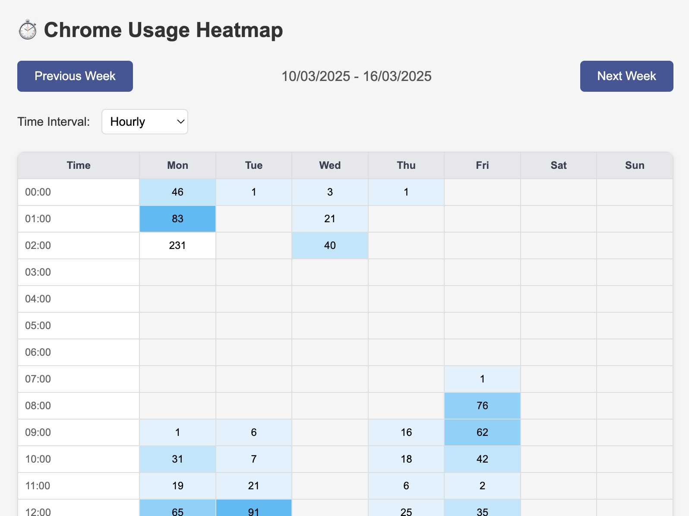

# Chrome Usage Tracker

**Chrome Usage Tracker** is a Chrome extension that visualizes your browsing activity as a weekly heatmap. It tracks page visits in 15-minute or hourly intervals, displaying usage patterns in shades of blue. The week starts on Monday, and you can navigate between weeks to explore past activity.

## Features

- 🔰 **Heatmap Visualization**: Displays browsing activity in a grid with blue intensity indicating visit frequency.
- 🔰 **Time Intervals**: Toggle between 15-minute or hourly granularity.
- 🔰 **Week Navigation**: Move between weeks using "Previous Week" and "Next Week" buttons.
- 🔰 **Usage Insights**: Logs start and end times of daily activity to the console.

## Screenshots



## Installation

### From Source
1. **Clone or Download**:
    - Clone this repository or download the ZIP file and extract it.
   ```bash
   git clone <repository-url>
   ```
2. **Load in Chrome**:
    - Open Chrome and go to `chrome://extensions/`.
    - Enable "Developer mode" in the top right.
    - Click "Load unpacked" and select the `chrome-usage-tracker` folder.
3. **Verify**:
    - The extension should appear in your toolbar with the name "Chrome Usage Tracker" and its icon (if provided).

## Usage
1. **Open the Extension**:
    - Click the extension icon in the Chrome toolbar to open the popup.
2. **View the Heatmap**:
    - The heatmap shows the current week (Monday–Sunday) by default.
    - Cells are colored from light blue (low activity) to dark blue (high activity).
3. **Switch Intervals**:
    - Use the "Time Interval" dropdown to switch between "15 Minutes" (96 rows) and "Hourly" (24 rows).
4. **Navigate Weeks**:
    - Click "Previous Week" or "Next Week" to view different weeks.
    - The week range is displayed above the heatmap (e.g., "Mar 10, 2025 - Mar 16, 2025").
5. **Check Usage Times**:
    - Open the Chrome Developer Tools (right-click > Inspect > Console) to see daily start/end times (e.g., "Fri: Usage started at 08:15, ended at 17:45").

## Acknowledgments
- Built with inspiration from Chrome’s `chrome.history` API.
- Designed for simplicity and usability.
